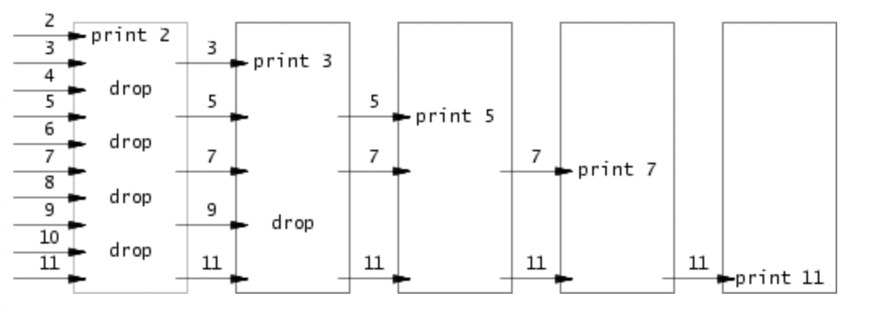

# Lab0

这个实验本身是比较简单的，但是必须要先看完xv6book的第一章，了解输入和输出、pipe和文件描述符。

## 准备

`make grade` 测试所有的函数

`make GRADEFLAGS=<function-name> grade` 测试一个函数（括号内替换成函数名）

**在qemu中使用自己的函数**：
将你的函数放在Makefile中

    UPROGS=\
    	$U/_cat\
    	$U/_echo\
    	$U/_forktest\
    	$U/_grep\
    	$U/_init\
    	...

**使用系统调用函数**：

    #include "../kernel/types.h"
    #include "./user.h"
    #include "../kernel/stat.h"

记住一定要把types放在最前面，否则其他头文件会报错

**gdb**:

在一个窗口调用`make qemu-gdb`，在另一个窗口调用`gdb-multiarch -q kernel/kernel`

`file user/_<func_name>` 选择需要测试的函数

### 我踩的几个坑

*   一定要以`exit(0)`结尾

    如果用return作为main函数的结尾，会无法停止程序，不知道为什么。。。

*   不要用srtcpy去写字符指针数组中的字符串，除非你已经设定了字符串大小。
    
    `char *str[MAXSIZE]` 不可直接用strcpy去写数组里的值，因为可能越界

    `char str[MAXLINE][MAXSIZE]` 这样可以用strcpy

*   exec函数

    example:
    ```
    char* new_argv[3];
    new_argv[0] = "echo";
    new_argv[1] = "hello";
    new_argv[2] = 0;
        
    exec("echo", new_argv);
    ```
    一定要在数组结束的地方放上0，便于函数找到数组的末尾

## sleep(1)

非常的简单，调用一下atoi和sleep函数即可

    int sleeptime = atoi(argv[1]);
        sleep(sleeptime);

## pingpong(1)

需要使用pipe函数

```
int p[2];
pipe(p);
char buf[512];
```

设置pipe后，`n = read(p[0], str, sizeof(str))`将从pipe中读取

`write(p[1], str, sizeof(str))`将向pipe中写入


## primes(0)



如图所示，每一个方框相当于一个进程，每一个进程保存一个左边pipe的读端口、一个右边pipe的写端口，当第一个进程读取完毕后，关闭向右的写端口，这时，右边的进程再进行读操作时，就会读取到EOF，右边的进程就知道已经没有任何输入了，这时便可以关闭向右的写端口，以此重复……

```c
int main(int argc, char* argv[])
{
    int p[2];
    pipe(p);
    int left, right, status, n;
    //    int eof = -1;
    if (fork() != 0) {
        close(p[0]);
        right = p[1];
        for (int i = 2; i <= 35; i++) {
            write(p[1], &i, sizeof(i));
        }
        close(right); // 关闭输入，将使子进程得到EOF
        wait(&status);
    } else {
        //循环
        while (1) {
            int prime, num;
            left = p[0]; // 这是左边pipe的读端口
            close(p[1]); // 关闭左边pipe的写端口
            pipe(p);     // 创建一个右边的pipe
            /* 读取第一个数 */
            if ((n = read(left, &prime, sizeof(prime))) < 0) {
                fprintf(2, "read error\n");
                exit(-1);
            }
            if (n == 0) {
                exit(0); // 第一个数就没读到，说明是最右边的进程，直接退出
            }
            printf("prime %d\n", prime);

            /* 已经读到了第一个数，再向右分支 */
            if (fork() != 0) {
                close(p[0]); // 关闭右边pipe的读端口
                right = p[1];
                // 读取第二个及以后的数，并发给right
                while (1) {
                    if ((n = read(left, &num, sizeof(prime))) < 0) {
                        fprintf(2, "read error\n");
                        exit(-1);
                    }
                    if (n == 0) {
                        close(right);  // 读到了EOF，关闭输入，向右进程传递EOF
                        wait(&status); // 读取完毕，等待右边进程结束
                        exit(0);
                    }
                    if (num % prime != 0) { // 可能的素数
                        write(right, &num, sizeof(num));
                    }
                }
            } else
                continue;
        }
    }
    //循环结束

    exit(0);
}
```

## find(2)

find函数需要先阅读`user/ls.c`看看作者是如何使用文件系统的

**文件序号**：

每一个文件都有它对应的编号（根目录为0），`.`代表当前文件夹，它的编号是当前文件夹的编号；`..`代表的是上一文件夹，它的编号是上一文件夹的编号（对于根目录，还是1）

**文件类型**：

`fstat(fd, &st)` 就可以查看`st.type`中的文件类型

```c
#define T_DIR     1   // Directory
#define T_FILE    2   // File
#define T_DEVICE  3   // Device
```

**文件夹**：

对文件夹的读取操作：

```c
struct dirent {
  unsigned short inum;
  char name[DIRSIZ];
}; // 这是fs.h中对dirent的定义

read(fd, &de, sizeof(de))
```

之后，就可以使用`de.name`或者`de.inum`来获得文件夹中文件的名字以及对应的文件序号

### 思路

读取两个参数，参数1是要开始搜索的位置，参数2是要搜索的文件名（不带path）。

定义一个find函数，它也接受两个参数，一个是位置，一个是文件名，它总是open该位置（可能是文件可能是文件夹），如果是文件，就看它是不是我们要找的文件，如果是文件夹，就递归地find它的子文件

```c
case T_DIR:
        while (read(fd, &de, sizeof(de)) == sizeof(de)) {
            if (de.inum == loc_inum || de.inum == pre_inum) // 文件夹为.(inum == location.inum)或者..(1)忽略
                continue;
            if (de.inum == 0) // 一般inum为0是文件夹的末尾部分
                continue;
            char nextLoc[512] = "";
            makePath(nextLoc, location, de.name);
            find(nextLoc, filename, de.inum, loc_inum);
        }
        close(fd);
        break;
    }
```

这里我用了一个函数makePath，很简单，就是给定两个字符串，在它们中间加上`/`然后放到一起就行了。

## xargs

xargs 能够将标准输入中的每一行作为参数提供给一个命令，例如：

当在命令行输入：

`echo hello too | xargs echo bye` 

产生：

```
bye hello too
```

如果有多行，对每一行会执行一遍命令

```c
$ echo "1\n2" | xargs echo line
line 1
line 2
$
```

**note**：它的行为和Linux中xargs有差异。

### 思路

这里对字符串的操作非常的麻烦。

我编写了一个函数用来处理字符串

* `parse_line`函数：将一行以空格分割的参数输入到一个数组中

```c
int main(int argc, char* argv[])
{
    char* my_argv[MAXARG];
    char line[512] = "";
    char* p = line;
    int i, status, n;

    /* read lines */
    while (1) {
        n = read(0, p, 1);

        if (*p == '\n' || n == 0) {
            /* 保证字符串的完整 */
            if (n == 0) {
                *(p + 1) = 0;
            } else {
                *p = 0;
            }
            /* 初始化将传递给子进程的参数列表 */
            for (i = 0; i < MAXARG; i++) {
                if (i < argc - 1) {
                    my_argv[i] = argv[i + 1];
                } else {
                    my_argv[i] = 0;
                }
            }
            parse_line(line, my_argv);
            /* 开始执行命令 */
            if (fork() != 0) {
                wait(&status);
                p = line; // 重置p的位置
            } else {
                exec(my_argv[0], my_argv);
                fprintf(2, "exec error\n");
                exit(-1); // 执行出错，退出
            }

            /* 如果已经到文件末尾，结束 */
            if (n == 0) {
                exit(0);
            }
        } else {
            p++;
        }
    }
    exit(0);
}
```

## 总结

整个实验思路是非常明确的，先从热身开始（sleep），然后练习了进程间通信以及输入输出（pingpong），primes是对此更复杂的应用；再到使用文件系统（find），最后是大杂烩（xargs）。
